# 论文插图插表具体内容与 Mermaid 草图

本文档用于辅助完成论文正文中的图表制作。其中：

1. 表格部分直接给出可粘贴进论文的具体内容。
2. 图形部分给出可导入 draw.io 的 Mermaid 草图。
3. 图 6-1 和图 6-2 属于界面或日志截图类图，不建议用 Mermaid 重绘，宜直接插入系统实际截图。
4. 第 2 章中涉及通用技术或研究综述的图，建议优先采用自绘图；若参考已有文献整理绘制，应在图下注明“根据文献[xx]整理绘制”。

---

## 一、表格具体内容

### 表1-1  论文结构安排表

| 章节 | 主要内容 | 作用 |
| --- | --- | --- |
| 第一章 绪论 | 介绍项目背景、项目现状与意义、项目主要内容、本人承担任务与论文结构 | 说明课题来源、研究目标和全文组织方式 |
| 第二章 项目相关研究和技术介绍 | 归纳异构设备监测、自适应采样、边端可靠执行等相关研究，介绍开发平台、框架软件、数据库软件和辅助工具 | 为后续需求分析和系统设计提供研究基础与技术基础 |
| 第三章 系统需求分析 | 分析总体需求、系统流程、使用角色与场景、功能需求、非功能需求和数据需求 | 明确系统应完成的功能范围与约束条件 |
| 第四章 系统概要设计 | 说明总体设计原则、网络架构、系统架构、功能模块划分、数据库概要、接口概要以及软硬件环境 | 给出系统整体结构和模块边界 |
| 第五章 系统详细设计 | 展开流程设计、功能模块设计、数据库设计、界面设计和接口设计 | 详细描述系统内部实现思路与组织方式 |
| 第六章 系统测试 | 说明测试计划、功能测试、结果抽样与结果分析 | 验证系统运行能力与实验评估链路 |
| 第七章 总结与展望 | 总结系统成果、分析不足并提出后续改进方向 | 对全文工作进行归纳与延伸 |

### 表2-1  相关研究类型与代表方法对比表

| 研究类型 | 代表方法或文献 | 核心思路 | 主要优点 | 主要局限 | 与本课题关系 | 基线属性 |
| --- | --- | --- | --- | --- | --- | --- |
| 异构设备监测与统一建模 | 单类设备监测方案、驱动接口监测方案、统一指标抽象研究[1][31] | 面向 CPU、GPU 或专用加速器采集厂商接口数据，并映射为可分析字段 | 字段细致、设备特性表达充分、采样精度较高 | 不同设备之间字段命名和调用方式差异较大，难以直接共用调度与存储链路 | 为本课题的统一采集接口和统一指标模型提供设计依据 | 不是对照基线，属于接入层研究基础 |
| 自适应采样方法 | 阈值反馈采样、代价约束采样、异常导向采样研究[2]-[15] | 根据状态波动、异常程度、采样代价或能耗约束动态调整采样频率 | 能降低冗余样本，兼顾实时性与资源开销 | 多数工作聚焦单类传感器或单类指标，较少同时考虑字段分层和边端执行压力 | 为本课题的故障演化调度提供方法基础 | 固定频率方案作为本课题强基线，自适应方案为主要对比对象 |
| 边端可靠执行与实验评估 | 边缘缓存、持久化队列、重试机制、可复现实验评估研究[1][23] | 通过本地缓冲、持久化、异步上传和统一指标评价保障系统稳定运行与实验可复核 | 适合受限边端环境，便于链路恢复和重复实验 | 通常与具体采样算法分离，缺少与异构监测一体化的完整闭环 | 为本课题的边端代理、持久化发送队列和评估报告提供工程基础 | 不作为采样策略基线，而是系统实现基础 |
| 固定频率采样对照 | 固定周期轮询 | 所有设备按统一周期执行采样并直接输出 | 实现简单、结果稳定、便于复现 | 平稳阶段样本冗余较多，异常阶段局部加密能力不足 | 作为本课题回放实验和实时实验的主要对照方案 | 强基线 |

### 表2-2  常见开发平台对比表

| 开发平台 | 主要支持语言 | 主要优点 | 主要局限 | 适用性分析 |
| --- | --- | --- | --- | --- |
| Visual Studio Code | Python、TypeScript、JavaScript、HTML、CSS 等 | 启动速度快、插件生态丰富、终端集成方便、适合前后端混合开发 | 高级项目管理能力弱于重型 IDE | 适合作为本项目主要开发平台 |
| PyCharm | Python 为主，也支持前端插件扩展 | Python 调试、静态分析和工程管理能力较强 | 多语言轻量协同灵活性一般 | 适合纯 Python 项目，对本项目可作辅助对比 |
| IntelliJ IDEA | Java 为主，同时支持多语言插件扩展 | 重构、工程组织和代码提示能力较强 | 更偏向 Java 生态，配置成本相对较高 | 对本项目不是主要选择 |

### 表2-3  系统主要框架软件及作用表

| 技术或框架 | 主要用途 | 选用原因 |
| --- | --- | --- |
| FastAPI | 提供数据接收、查询、控制、告警和实验接口 | 开发效率高，结构清晰，便于定义接口模型和返回结构 |
| React | 构建监控仪表盘、控制台和告警中心页面 | 组件化组织清晰，适合单页应用和动态状态刷新 |
| ECharts | 绘制实时趋势图、评估图和统计图 | 图表类型丰富，适合监控可视化和实验结果展示 |

### 表2-4  数据库软件及用途说明表

| 软件或机制 | 部署位置 | 主要用途 | 选用原因 |
| --- | --- | --- | --- |
| SQLite | 中心服务端 | 存储设备快照、历史指标、事件、告警和规则数据 | 部署简单，适合单机原型和中小规模实验系统 |
| SQLite WAL 机制 | 中心服务端与边端本地持久化队列 | 提高并发读写稳定性，支持崩溃恢复与高频写入 | 适合高频采样记录写入和本地可靠缓存 |

### 表2-5  辅助管理工具说明表

| 工具名称 | 主要用途 | 使用环节 |
| --- | --- | --- |
| Git | 版本管理、历史追踪和阶段性成果整理 | 代码开发与论文材料整理 |
| PowerShell | 启动脚本、自动化运行与环境联调 | 系统启动、实验脚本执行、日志检查 |
| NumPy | 数值计算与回放轨迹生成辅助 | 实验数据生成与处理 |
| Pandas | 表格化数据读取、清洗和统计 | 评估指标计算与结果整理 |
| Matplotlib | 输出实验对比图和报告图像 | 评估报告图形化结果生成 |
| Prometheus | 指标上报与监控扩展支持 | 可选运行监控与性能观察 |
| Grafana | 监控面板扩展展示 | 可选图形化监控扩展 |

### 表3-1  系统使用职责划分表

| 角色 | 主要职责 | 典型操作 |
| --- | --- | --- |
| 监控观察者 | 关注设备运行状态、事件和告警信息 | 查看仪表盘概览、查看实时趋势、浏览事件日志、查看告警中心 |
| 实验操作者 | 负责生成轨迹、启动实验、查看报告与结果对照 | 触发回放轨迹生成、启动固定频率与故障演化对照实验、查看报告输出 |
| 系统维护者 | 负责系统联调、环境维护、规则维护和链路检查 | 启动后端与前端、检查健康接口、维护告警规则、检查数据库记录 |

### 表4-1  系统总体设计原则说明表

| 设计原则 | 原则含义 | 在系统中的体现 |
| --- | --- | --- |
| 统一抽象原则 | 对异构设备采用统一采集接口和统一字段模型 | CPU、GPU、NPU 与回放数据都映射到统一指标结构 |
| 分层采样原则 | 将快线字段与慢线字段分层组织 | 利用率、温度等高频字段每轮采集，扩展诊断字段按需补采 |
| 闭环控制原则 | 把采样调度与边端执行反馈结合起来 | 调度器同时考虑紧迫度、字段优先级和执行压力 |
| 可靠执行原则 | 保障边端数据在波动环境下仍可缓存和恢复 | 环形缓冲、本地持久化发送队列、异步上传与重试机制 |
| 可复现原则 | 使实验可在统一输入条件下重复进行 | 统一回放轨迹、统一真值事件、统一评估脚本和结构化报告 |

### 表4-2  采样相位与策略映射表

| 采样相位 | 主要触发条件 | 字段策略 | 传输策略 | 间隔特征 |
| --- | --- | --- | --- | --- |
| 聚焦采样 | 设备异常，或紧迫度较高，或控制分数较高 | 全量聚焦，优先补采慢线诊断字段 | 直传或缓冲上传 | 收紧到最小采样间隔，典型为 1.0 s |
| 恢复观测 | 紧迫度中等，字段优先级较高，或控制分数进入恢复区间 | 分层补采或事件补采 | 直传或缓冲上传 | 介于聚焦与巡航之间，典型为 1.5 s 至 4.0 s |
| 巡航巡检 | 设备总体平稳，执行压力较低 | 快线必采，按轮次进行巡检补采 | 直传、本地缓存或轻缓冲 | 可放宽到 4.0 s 以上，平稳时可达上限 |
| 边端降级 | 队列积压、死信上升或缓冲压力较高 | 降级保活，以快线字段为主 | 降级缓冲 | 在保持可观测性的前提下放宽采样节奏 |

### 表4-3  系统概念数据对象说明表

| 数据对象 | 主要内容 | 主要作用 |
| --- | --- | --- |
| 设备快照对象 | 当前设备状态、最近时间戳、当前相位和控制信息 | 支撑概览页和设备列表快速查询 |
| 历史指标对象 | 每次采样的统一指标、调度结果和边端反馈 | 支撑趋势曲线、评估统计和历史回溯 |
| 事件对象 | 异常事件、告警联动事件、控制事件 | 支撑事件查询和审计追踪 |
| 告警对象 | 告警状态、级别、消息和生命周期信息 | 支撑告警中心和活动告警统计 |
| 规则对象 | 告警规则定义、阈值、比较方式和使能状态 | 支撑规则维护和异常联动 |
| 边端发送对象 | 待发送记录、重试次数、错误信息和状态 | 支撑边端可靠上传与失败恢复 |

### 表4-4  外部接口概要说明表

| 接口类别 | 主要功能 | 服务对象 | 说明 |
| --- | --- | --- | --- |
| 健康检查接口 | 返回服务运行状态 | 启动脚本、维护者 | 用于检查服务是否在线 |
| 数据接收接口 | 接收边端批量指标和事件记录 | 边端代理 | 支持压缩或普通 JSON 数据 |
| 数据查询接口 | 提供设备、实时指标、历史曲线、事件和概览查询 | 前端页面 | 为仪表盘和告警页面提供数据源 |
| 实验评估接口 | 返回最新评估报告内容 | 仪表盘评估区和控制台 | 用于读取实验结果 |
| 控制接口 | 触发轨迹生成、回放对照、实时采集和任务取消 | 控制台 | 用于实验任务编排 |
| 告警规则接口 | 查询、创建、更新、删除和导入导出规则 | 告警中心 | 用于规则维护与管理 |

### 表4-5  硬件运行环境表

| 硬件项目 | 配置或型号 | 主要用途 |
| --- | --- | --- |
| 开发主机处理器 | 12th Gen Intel(R) Core(TM) i7-12700H | 本地后端、前端和 CPU 采样联调 |
| 开发主机内存 | 约 16 GB | 本地开发、数据库运行和实验评估 |
| 开发主机图形设备 | Intel(R) UHD Graphics | GPU 侧在线采样联调 |
| 边端 NPU 主板 | 亿晟科技 YS-EC588 工业级安卓/鸿蒙兼容主板 | NPU 实机采集链路验证 |
| 边端 NPU 型号识别结果 | RK3588 NPU | 用于验证板端 NPU 的统一接入能力 |

### 表4-6  软件开发环境表

| 软件环境 | 版本或说明 | 主要用途 |
| --- | --- | --- |
| Windows 11 64 位 | 开发与联调环境 | 本地运行后端、前端与实验脚本 |
| Python | 3.9.13 | 采样器、后端服务、实验脚本与评估程序 |
| Node.js | 20.17.0 | 前端依赖安装与构建 |
| React | 18.3.1 | 前端页面框架 |
| TypeScript | 5.6.3 | 前端类型约束与工程开发 |
| Vite | 5.4.10 | 前端构建与开发支持 |
| ECharts | 5.6.0 | 图表绘制 |
| SQLite | 随 Python sqlite3 运行环境提供 | 中心数据库和边端持久化队列 |
| Visual Studio Code | 以实际安装版本为准 | 主要开发平台 |

### 表5-1  设备接入与字段分层设计表

| 设备类型 | 快线字段 | 慢线字段 | 采集方式 | 说明 |
| --- | --- | --- | --- | --- |
| CPU | 利用率、芯片温度、板级温度、功耗、内存占用、采集时间 | 频率、频率上限、线程数、上下文切换率、三级缓存、I/O 利用率 | 基于系统监测接口和轻量命令采集 | 适合主机侧运行状态监测 |
| GPU | 利用率、温度、功耗、显存利用率、运行状态 | 频率、功耗上限、总线吞吐、风扇转速、ECC 统计、限频原因 | 基于设备管理接口和系统传感器采集 | 支持原生采集和通用采集路径 |
| NPU | 利用率、芯片温度、运行状态、占空比 | 频率、频率上限、调频策略、限频标记、复位计数 | 基于板端调试连接或系统节点采集 | 已完成 YS-EC588 主板实机验证 |
| 回放数据 | 利用率、温度、功耗、内存、调度结果等按轨迹提供 | 与轨迹文件中定义的扩展字段一致 | 按时间推进读取轨迹文件 | 用于统一对照实验与可复现实验 |

### 表5-2  故障演化调度阈值与策略表

| 控制项或策略项 | 默认值或阈值 | 设计作用 | 说明 |
| --- | --- | --- | --- |
| 最小采样间隔 | 1.0 s | 聚焦阶段快速观测异常窗口 | 保证关键窗口观测密度 |
| 最大采样间隔 | 6.0 s | 平稳阶段降低冗余采样 | 兼顾低开销与基本可观测性 |
| 慢线刷新轮次 | 6 轮 | 控制慢线字段补采节奏 | 避免扩展诊断字段过于稀疏 |
| 基线平滑系数 | 0.12 | 维护利用率、温度和功耗基线 | 平衡跟踪速度与抗短时波动能力 |
| 异常相位基线缩放系数 | 0.55 | 异常阶段减缓基线跟随 | 降低尖峰对长期基线污染 |
| 聚焦触发紧迫度阈值 | 58 | 进入聚焦采样的重要阈值 | 紧迫度足够高时直接收紧间隔 |
| 聚焦触发控制分数阈值 | 50 | 控制量综合触发聚焦 | 体现综合控制强度 |
| 恢复触发紧迫度阈值 | 30 | 从巡航进入恢复观测 | 异常退潮后保持一定观察密度 |
| 恢复触发字段优先级阈值 | 40 | 促进慢线补采 | 保证诊断字段及时刷新 |
| 降级触发执行压力阈值 | 78 | 边端压力较高时进入降级 | 防止上传和写盘链路持续积压 |
| 待发送记录压力区间 | 40 至 300 | 计算执行压力 | 用于反映 outbox 积压程度 |
| 死信记录压力区间 | 0 至 10 | 计算执行压力 | 反映重试失败程度 |
| 缓冲积压比例 | backlog/capacity | 计算执行压力 | 反映内存缓冲拥塞情况 |
| 控制分数权重 | 0.52、0.36、0.30 | 综合紧迫度、字段优先级和执行压力 | 体现“紧迫度主导、执行压力制动”的设计思路 |

### 表5-3  默认告警规则设计表

| 规则标识 | 规则名称 | 规则来源 | 监测字段 | 触发条件 | 严重级别 | 自动恢复 | 说明 |
| --- | --- | --- | --- | --- | --- | --- | --- |
| device_unavailable | 设备不可用 | 指标规则 | status | 不等于 ok | 高 | 是 | 反映设备失联或采样不可用 |
| high_evolution_score | 故障演化高紧急度 | 指标规则 | evolution_score | 大于等于 60 | 高 | 是 | 反映调度器识别出的高风险演化状态 |
| high_temperature | 温度过高 | 指标规则 | chip_temp_c | 大于等于 80 | 中 | 是 | 反映温度异常升高 |
| collector_unavailable | 采集器异常 | 事件规则 | event_type | 等于 collector_unavailable | 高 | 否 | 反映采样器或采集后端异常 |

### 表5-4  逻辑实体结构说明表

| 实体名称 | 关键属性 | 实体关系 | 说明 |
| --- | --- | --- | --- |
| 设备实体 | 设备编号、设备类型、状态、当前策略 | 与历史指标实体一对多 | 保存设备最新快照 |
| 历史指标实体 | 时间戳、核心指标、调度结果、边端反馈 | 多条记录对应同一设备 | 保存时序历史数据 |
| 事件实体 | 事件类型、严重级别、消息、来源 | 与设备实体逻辑关联 | 保存异常和操作事件 |
| 告警实体 | 告警规则、状态、级别、消息、生命周期 | 与设备实体和规则实体逻辑关联 | 保存活动告警与历史告警 |
| 告警规则实体 | 规则标识、字段名、阈值、使能状态 | 可对应多条告警实体 | 保存规则配置 |
| 发送队列实体 | 记录类型、序列化负载、重试状态 | 与边端运行过程关联 | 保存待上传记录 |

### 表5-5  中心数据库表结构设计表

| 表名 | 主键 | 关键字段 | 主要用途 |
| --- | --- | --- | --- |
| devices | device_id | device_type、status、latest_timestamp、utilization、sample_interval_s、evolution_score、phase、field_policy、transport_policy、control_score | 保存设备最新快照 |
| metrics | id | timestamp、device_id、utilization、chip_temp_c、power_w、mem_util_percent、sample_interval_s、evolution_score、field_priority_score、execution_pressure_score、control_score、phase、field_policy、transport_policy、outbox_pending、outbox_dead、ring_backlog、status | 保存历史指标与调度结果 |
| events | id | timestamp、device_id、event_type、severity、message、detail、source | 保存事件与联动记录 |
| alerts | id | device_id、rule_key、title、severity、status、message、first_seen_at、last_seen_at、acknowledged_by、silenced_until、closed_at、event_count、last_value | 保存告警生命周期状态 |
| alert_rules | rule_key | title、rule_source、field_name、operator、threshold_value、threshold_text、severity、enabled、auto_resolve、message_template | 保存告警规则定义 |

### 表5-6  关键字段与约束设计表

| 字段或约束 | 所在表 | 约束类型 | 设计说明 |
| --- | --- | --- | --- |
| device_id | devices | 主键 | 保证每台设备在快照表中只有一条当前记录 |
| id | metrics | 自增主键 | 保证历史采样记录可按时间顺序增长 |
| idx_metrics_device_id | metrics | 组合索引 | 提高按设备查询历史曲线的效率 |
| idx_events_device_id | events | 组合索引 | 提高按设备查询事件日志的效率 |
| idx_alerts_active | alerts | 索引 | 提高活动告警查询效率 |
| idx_alerts_active_unique | alerts | 条件唯一索引 | 保证同一设备同一规则在活动状态下仅有一条告警 |
| status | alerts | 状态字段 | 区分打开、已确认、已静默和已恢复状态 |
| rule_key | alert_rules | 主键 | 保证每条规则可被唯一定位 |
| status | outbox | 状态字段 | 区分 pending 与 dead，控制重试与死信 |
| next_retry_at | outbox | 调度字段 | 用于控制指数退避后的下一次重试时刻 |

### 表5-7  外部 HTTP 接口详细说明表

| 接口名称 | 请求方式 | 主要输入 | 主要输出 | 功能说明 |
| --- | --- | --- | --- | --- |
| /health | GET | 无 | 服务状态 | 健康检查 |
| /api/ingest | POST | 批量指标或事件记录 | 接收数量与写入摘要 | 边端数据接收 |
| /api/devices | GET | 无 | 设备快照列表 | 查询设备概览 |
| /api/metrics/realtime | GET | 无 | 实时指标列表 | 查询实时状态 |
| /api/metrics/history | GET | device_id、limit | 单设备历史点集 | 查询历史趋势 |
| /api/metrics/compare | GET | device_ids、limit | 多设备历史序列 | 查询对比曲线 |
| /api/metrics/logs | GET | limit | 最近日志列表 | 查询运行日志 |
| /api/events | GET | device_id、severity、limit | 事件列表 | 查询事件记录 |
| /api/alerts/summary | GET | 无 | 告警摘要 | 查询告警统计 |
| /api/alerts | GET | status、device_id、severity、rule_key、limit | 告警列表 | 查询活动和历史告警 |
| /api/alerts/trends | GET | hours | 告警趋势统计 | 查询告警趋势 |
| /api/alerts/{id}/acknowledge | POST | 操作者信息 | 告警记录 | 确认单条告警 |
| /api/alerts/batch/acknowledge | POST | 告警编号集合、操作者信息 | 批量处理结果 | 批量确认告警 |
| /api/alerts/{id}/silence | POST | 静默时长、操作者信息 | 告警记录 | 静默单条告警 |
| /api/alerts/batch/silence | POST | 告警编号集合、静默时长、操作者信息 | 批量处理结果 | 批量静默告警 |
| /api/alerts/{id}/unsilence | POST | 操作者信息 | 告警记录 | 解除静默 |
| /api/alert-rules | GET/POST | 规则定义 | 规则列表或单条规则 | 查询与创建告警规则 |
| /api/alert-rules/{rule_key} | PATCH/DELETE | 规则更新或删除信息 | 更新后规则或删除结果 | 维护规则 |
| /api/alert-rules/export | GET | 无 | 规则导出结果 | 导出规则 |
| /api/alert-rules/import | POST | 规则集合、导入模式 | 导入结果 | 导入规则 |
| /api/scheduler/config | GET | 无 | 调度器配置摘要 | 查看调度参数概要 |
| /api/dashboard/overview | GET | 无 | 仪表盘概览数据 | 页面摘要统计 |
| /api/experiments/evaluation | GET | 可选报告路径 | 评估报告内容 | 读取实验评估结果 |
| /api/control/status | GET | 无 | 控制服务状态与最近任务 | 控制台状态查询 |
| /api/control/trace | POST | 轨迹参数 | 控制任务对象 | 生成回放轨迹 |
| /api/control/replay-compare | POST | 对照实验参数 | 控制任务对象 | 启动回放对照实验 |
| /api/control/live | POST | 实时采集参数 | 控制任务对象 | 启动实时采集任务 |
| /api/control/cancel | POST | 无 | 控制任务对象 | 取消当前任务 |

### 表6-1  系统测试目的与对象表

| 测试项 | 测试目标 | 测试对象 |
| --- | --- | --- |
| 启动与健康检查 | 验证系统能否统一启动并对外提供服务 | 启动脚本、健康接口、前后端联调链路 |
| 数据接收与持久化 | 验证边端记录能否进入中心数据库 | 数据接收接口、数据库写入逻辑 |
| 页面展示功能 | 验证仪表盘、控制台和告警中心能否正常显示 | 前端页面和查询接口 |
| 回放对照实验 | 验证固定频率与故障演化模式能否在统一输入下运行 | 回放实验脚本、控制服务 |
| 评估报告输出 | 验证评估脚本能否输出结构化报告和图像结果 | 评估脚本和报告读取接口 |
| 告警联动 | 验证规则评估、告警生成与事件记录能否联动 | 规则模块、告警模块、事件模块 |
| NPU 实机接入 | 验证板端 NPU 能否完成真实采集和统一建模 | YS-EC588 主板及 NPU 适配链路 |

### 表6-2  系统测试用例设计表

| 用例编号 | 测试内容 | 前置条件 | 预期结果 |
| --- | --- | --- | --- |
| TC-01 | 统一启动与健康检查 | 已安装 Python 与前端依赖 | 后端成功启动，健康接口返回正常状态 |
| TC-02 | 指标与事件数据接收 | 后端服务已启动，具备测试数据源 | 数据接收接口返回成功，数据库记录增加 |
| TC-03 | 仪表盘实时展示 | 数据库中已有设备与指标数据 | 仪表盘能显示设备概览、趋势与事件信息 |
| TC-04 | 控制台触发回放实验 | 回放轨迹与评估脚本可用 | 控制台可成功启动实验并显示进度 |
| TC-05 | 回放对照与报告输出 | 固定频率与故障演化实验均可运行 | 生成 JSON、Markdown 和图像化评估结果 |
| TC-06 | 告警与事件联动 | 已启用默认告警规则 | 规则触发后产生告警，并记录相关事件 |
| TC-07 | NPU 实机采集 | 板端设备可访问 | 能输出 NPU 采样记录并纳入统一模型 |

### 表6-3  系统测试范围表

| 测试类别 | 主要内容 | 覆盖模块 |
| --- | --- | --- |
| 基础运行测试 | 启动脚本、健康接口、静态页面托管 | 启动脚本、后端服务、前端构建结果 |
| 数据链路测试 | 边端采样、记录入队、后端接收、数据库写入 | 采样器、边端代理、数据接收模块、数据库服务 |
| 页面功能测试 | 仪表盘、控制台、告警中心查询与展示 | 前端页面、查询接口、统计接口 |
| 实验评估测试 | 回放生成、双模式运行、评估报告输出 | 控制服务、实验脚本、评估脚本 |
| 告警联动测试 | 规则评估、告警状态变更、事件写入 | 规则模块、告警模块、事件模块 |
| 板端接入测试 | NPU 板端采集与统一模型封装 | NPU 适配器、统一字段模型、记录输出链路 |

### 表6-4  数据接收与持久化测试结果表

| 检查项 | 测试结果 | 说明 |
| --- | --- | --- |
| 设备快照记录数 | 3 | 数据库中形成 CPU、GPU、NPU 三类设备快照 |
| 指标记录数 | 131 | 与固定频率和故障演化两组对照实验总采样点一致 |
| 事件记录数 | 12 | 包含真值事件与联动事件记录 |
| 告警记录数 | 4 | 形成与默认规则对应的告警对象 |
| 告警规则数 | 4 | 默认规则已正确载入数据库 |
| 告警状态分布 | 1 条活动告警，3 条已恢复告警 | 说明告警生命周期更新正常 |
| 持久化结论 | 数据接收、入库、快照更新与规则联动链路正常 | 满足中心端持久化要求 |

### 表6-5  回放对照与报告输出测试结果表

| 检查项 | 测试结果 | 说明 |
| --- | --- | --- |
| 回放轨迹 | 使用统一生成的 110 s 异构回放轨迹 | 包含 CPU、GPU、NPU 三类设备状态变化与 7 个标准事件点 |
| 对照模式 | 固定频率模式为 5 s，故障演化模式为 1 s 至 8 s | 两种模式在同一输入条件下运行 |
| 结构化输出 | 成功生成 JSON 报告、Markdown 报告和图像结果 | 报告链路完整 |
| 评估内容 | 成功统计采样点数量、冗余率、间隔分布、延迟分布、资源开销等指标 | 满足论文评估要求 |
| 可重复性 | 同一回放输入下可重复生成同类报告 | 满足可复现实验要求 |
| 测试结论 | 系统能够完成从回放输入到评估输出的完整实验闭环 | 对照实验链路运行正常 |

### 表6-6  NPU 实机采集测试结果表

| 检查项 | 测试结果 | 说明 |
| --- | --- | --- |
| 测试平台 | 亿晟科技 YS-EC588 工业级安卓/鸿蒙兼容主板 | 用于板端 NPU 实机验证 |
| 设备识别 | 成功识别 npu0，设备类型为 NPU | 统一接入链路正常 |
| 型号识别 | 型号识别结果为 RK3588 NPU | 说明静态信息读取正常 |
| 快线字段采集 | 可稳定采集利用率、芯片温度和运行状态 | 满足高频观测要求 |
| 慢线字段补采 | 可补采频率、频率上限和调频策略，部分诊断字段按板端可得性返回 | 满足扩展诊断要求 |
| 原始指标记录数 | 178 条 | 来自 real_npu_raw_metrics.csv |
| 原始事件记录数 | 0 条 | 本次链路验证未触发异常事件 |
| 链路结论 | 已完成 NPU 实机采集、统一封装和记录输出验证 | 说明板端接入链路已跑通 |

### 表6-7  最新评估结果抽样表

| 指标项 | 固定频率模式 | 故障演化采样模式 | 结果说明 |
| --- | --- | --- | --- |
| 采样点数量 | 66 | 65 | 演化模式采样点减少 1.52% |
| 冗余率 | 34.85% | 16.92% | 演化模式冗余率下降 17.93 个百分点 |
| 平均采样间隔 | 5.0085 s | 5.2692 s | 演化模式在平稳阶段整体间隔略大 |
| 采样间隔 P95 | 5.016 s | 8.016 s | 演化模式允许在低负载阶段放宽间隔 |
| 最小采样间隔 | 4.984 s | 1.0 s | 演化模式可在异常窗口收紧采样 |
| 延迟 P50 | 2.171 s | 2.219 s | 两种模式中位响应时间接近 |
| 延迟 P95 | 3.8841 s | 3.6381 s | 演化模式长尾延迟更低 |
| CPU 平均开销 | 0.0409% | 0.48% | 演化模式存在额外调度和补采计算开销 |
| 内存平均开销 | 66.5459 MB | 66.2892 MB | 演化模式内存占用略低 |
| 慢线激活率 | 22.73% | 23.08% | 两种模式慢线补采活跃程度接近 |
| 缓冲上传占比 | 0.0% | 55.38% | 演化模式中边端可靠执行链路实际参与运行 |
| 聚焦相位占比 | 0.0% | 3.08% | 演化模式已实际触发聚焦采样 |

---

## 二、Mermaid 草图

### 图2-1  异构设备监测与自适应采样相关研究分类图

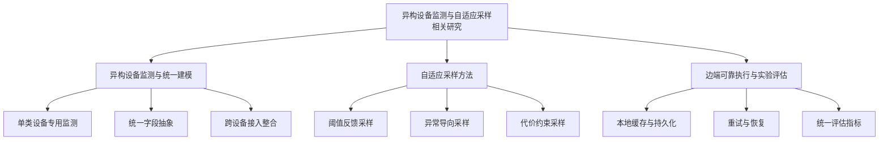

### 图2-2  FastAPI 框架组成结构图

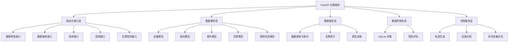

### 图2-3  React 前端框架结构图

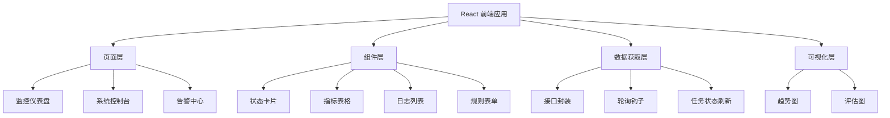

### 图2-4  ECharts 可视化结构图

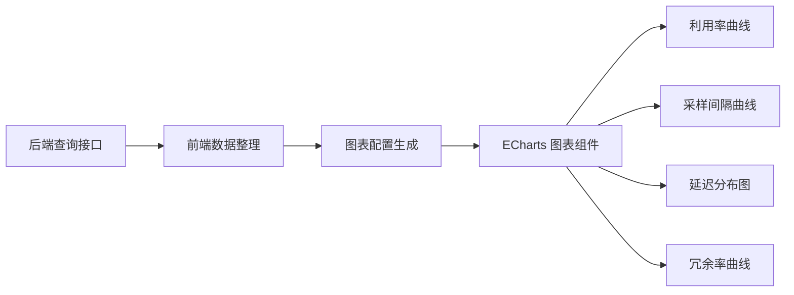

### 图2-5  SQLite WAL 工作机制图

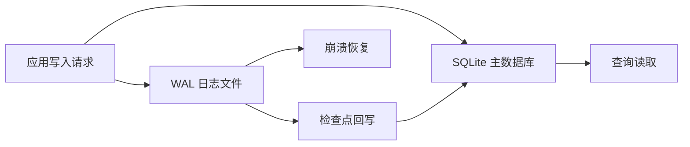

### 图3-1  系统总体需求示意图

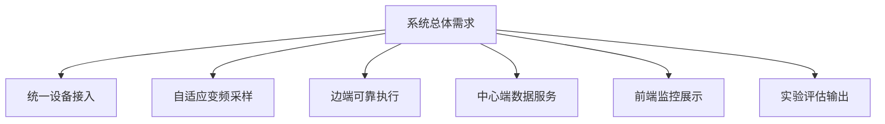

### 图3-2  系统业务流程图

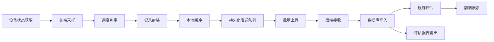

### 图3-3  系统角色用例图

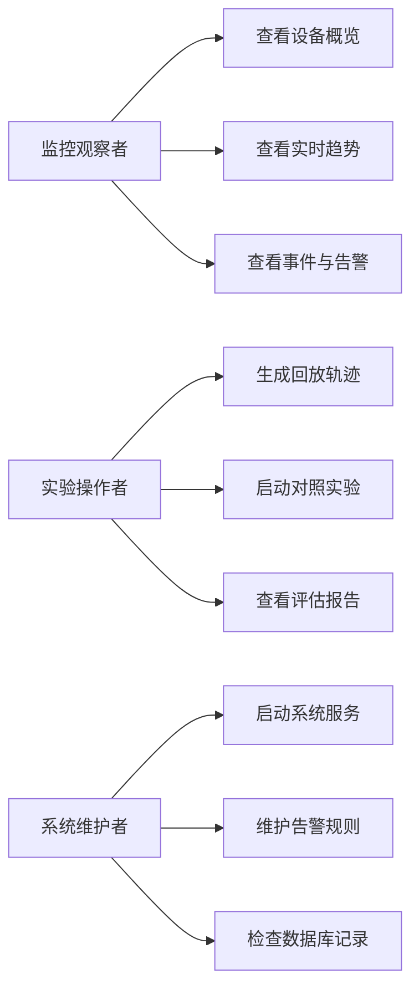

### 图3-4  系统数据流分析图

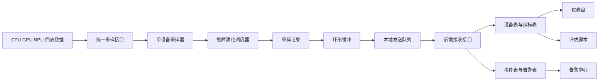

### 图4-1  系统网络架构图

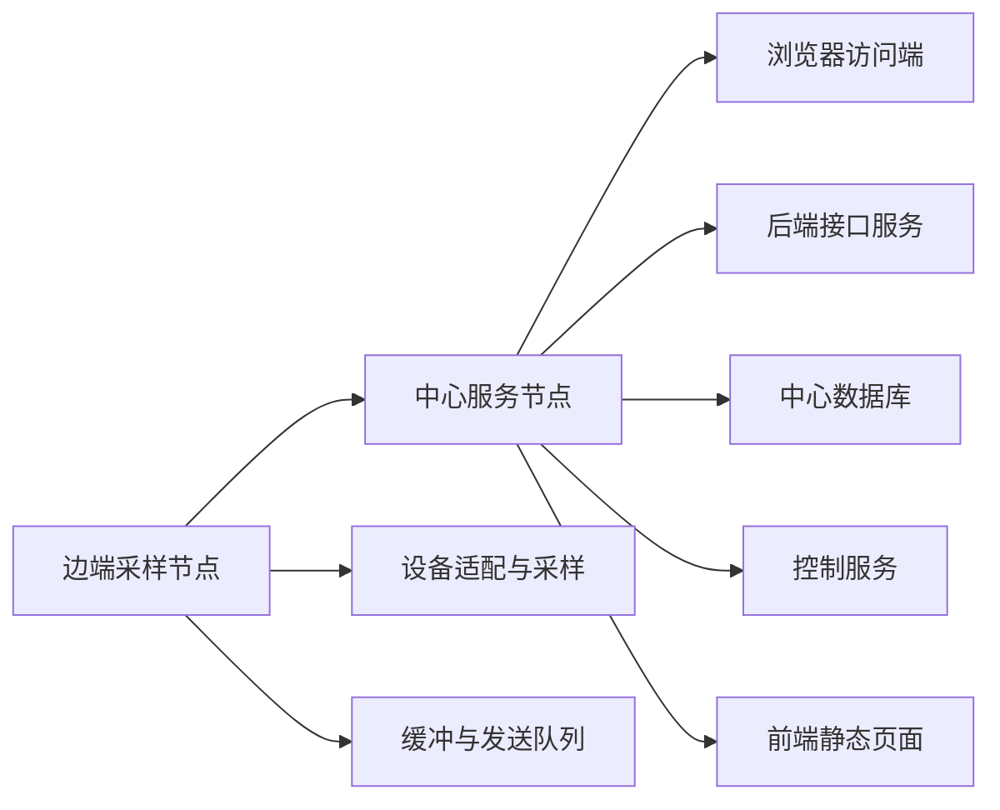

### 图4-2  系统总体架构图

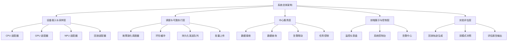

### 图4-3  系统功能模块划分图

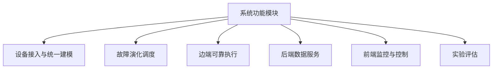

### 图4-4  系统 E-R 图

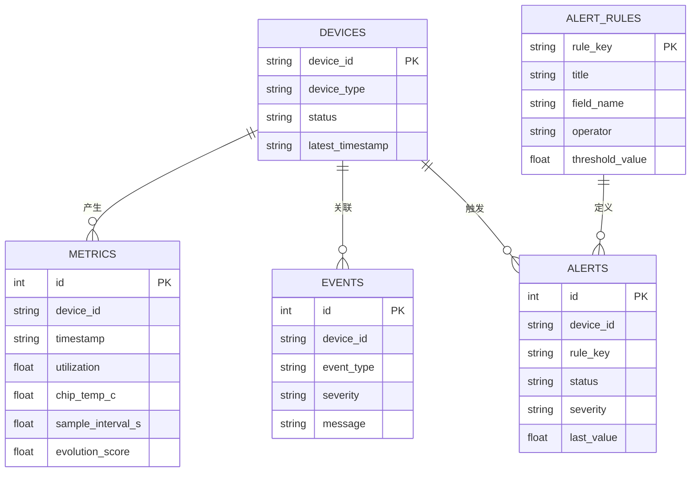

### 图4-5  系统内部接口关系图

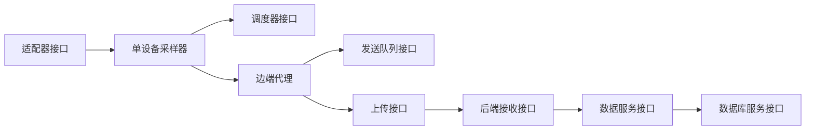

### 图5-1  实时采集主流程图

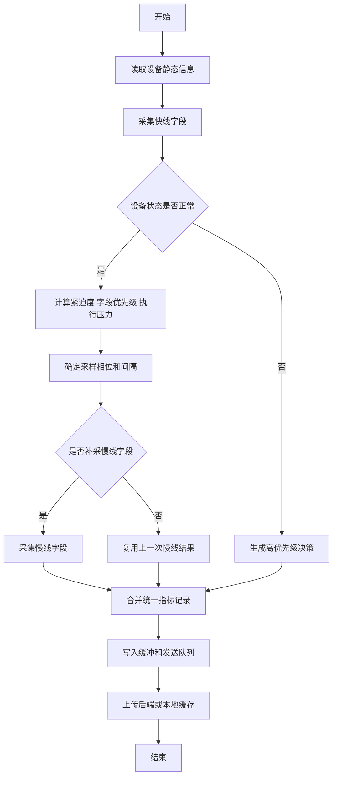

### 图5-2  回放对照实验流程图

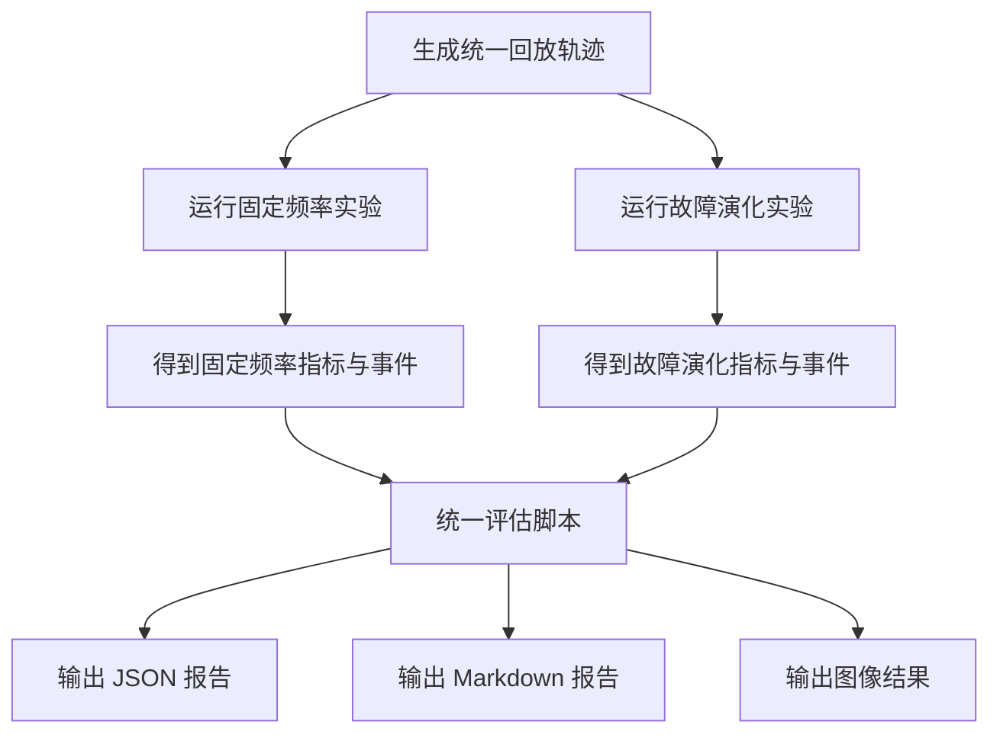

### 图5-3  数据查询与界面刷新流程图


### 图5-4  异常与告警联动流程图

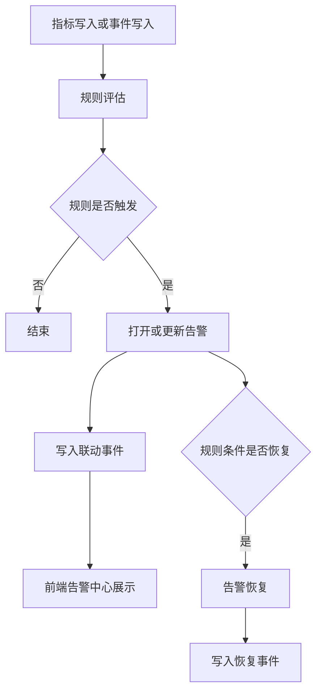

### 图5-5  边端可靠执行模块时序图

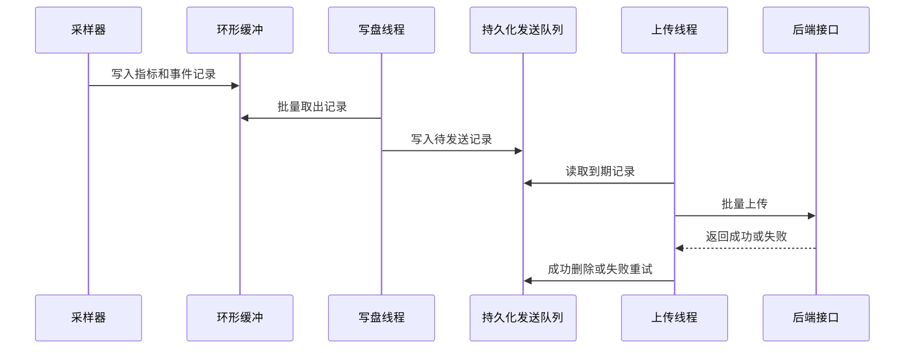

### 图5-6  前端页面结构图

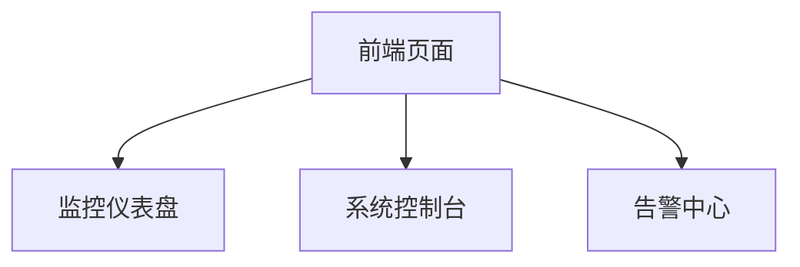

### 图5-7  仪表盘页面结构示意图

```mermaid
flowchart TB
    A[仪表盘页面]
    A --> B[总体概览区]
    A --> C[实时趋势区]
    A --> D[事件日志区]
    A --> E[实验评估区]

    B --> B1[摘要统计卡片]
    B --> B2[设备状态卡片]
    B --> B3[设备快照表]

    C --> C1[利用率曲线]
    C --> C2[演化分数曲线]
    C --> C3[采样间隔曲线]

    D --> D1[最近事件]
    D --> D2[最近日志]

    E --> E1[关键指标摘要]
    E --> E2[延迟与冗余图]
```

### 图5-8  控制台页面结构示意图

```mermaid
flowchart TB
    A[控制台页面]
    A --> B[任务状态区]
    A --> C[轨迹生成参数区]
    A --> D[对照实验参数区]
    A --> E[实时采集参数区]
    A --> F[任务进度区]
    A --> G[任务日志区]
    A --> H[最近任务区]
```

### 图5-9  关键内部接口时序图

```mermaid
sequenceDiagram
    participant P as 页面
    participant R as 路由接口
    participant S as 数据服务
    participant D as 数据库服务

    P->>R: 发起查询请求
    R->>S: 调用聚合服务
    S->>D: 查询设备 指标 事件 告警
    D-->>S: 返回结果
    S-->>R: 组装响应数据
    R-->>P: 返回结构化结果
```

### 图6-1  统一启动与关键接口返回日志截图

此图属于系统实际运行截图，建议直接使用启动窗口和接口返回结果截图，不使用 Mermaid 重绘。

### 图6-2  控制台任务执行流程截图

此图属于系统实际界面截图，建议直接使用控制台页面任务执行过程截图，不使用 Mermaid 重绘。

